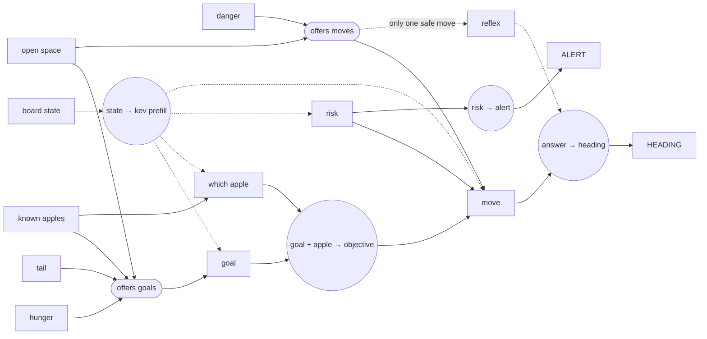

# SNAKE // KEV

Kev-0.8B plays Snake in a desktop window, and you can watch its decision graph fire as it thinks, like Jev's Doom demo.

<video src="assets/demo.mp4" controls width="100%"></video>
It's one Python file. The window uses tkinter and there's no web server or browser. On every move the game writes the board out as text. Kev reads that text once, then answers a small graph of questions: what the goal is, which apple to go for, how risky the position is, and which way to move. Each node in the graph lights up at the moment it is actually computed.


## Quick start

You need Python 3.12 or 3.13

```bash
pip install torch "transformers>=5.17" huggingface_hub
python snake_kev.py
```

The first run downloads the Kev-0.8B adapter and the Qwen3.5-0.8B-Base model it's built on, about 1.7 GB, into the Hugging Face cache. Download progress shows in the terminal. Later runs start in about 20 seconds.

If you have an **NVIDIA GPU**, install the CUDA build of torch from [pytorch.org](https://pytorch.org/get-started/locally/) first. The game uses the GPU automatically and runs in bf16. On CPU it runs in fp32.

To look at the window without downloading anything:

```bash
python snake_kev.py --mock        # a fake random "model" drives the same UI
```

## Controls

| Key | What it does |
|---|---|
| `space` | Pause / resume |
| `n` | Play a single move (and pause) |
| `r` | Restart the game |
| `+` / `-` | Shorter / longer pause between moves |
| `f` | Speed of the graph animation: normal → slow → fast |
| `s` | Situation report: the exact text Kev reads this move |
| `esc` | Quit |

## Options

```text
--mock            fake random model (UI preview, no download)
--headless N      no window: play N moves and print every decision in the terminal
--device cuda|cpu default: cuda if available
--threads N       torch CPU threads
--grid N          board size (default 12)
--seed N          random seed for apple placement
--move-ms N       pause after each move (default 250)
--fire-ms N       minimum time between graph nodes firing (default 110)
--zoom X          UI scale (default: follows your screen DPI)
```

## Reading the screen

**The board is at the top left.** The snake's head colour is Kev's ALERT output: green for calm, amber for caution, red for danger. Gold apples are worth 3 points and disappear after 35 moves; the number on one shows how many moves it has left. The amber arrow shows the move Kev has picked, just before the snake makes it.

**The decisions panel is at the top right.** It lists every question Kev was asked this move, with a probability bar for each option, how long it took, and the facts attached to each option.

**The graph is at the bottom.**

| Shape | Meaning |
|---|---|
| Dashed green box | A fact the game works out: apples, hunger, tail, danger, open space |
| Dashed pill | Code that decides which options are offered: *offers goals*, *offers moves* |
| Ellipse | Plain code combining answers: prefill, objective, heading, alert |
| **Amber box** | **A question Kev answers** |
| Solid green box | An output that controls the game: `HEADING`, `ALERT` |
| Red dashed box | The reflex path: used when only one direction is safe, so Kev isn't asked |

Bright nodes and edges were used on this move and dim ones weren't. The dots travelling along edges show data flowing.

### The graph



### What Kev is asked

| Question | Type | Options |
|---|---|---|
| **goal**: "What should the snake's top priority be right now?" | choice | `eat_apple`, `open_space`, `follow_tail` (only when the tail can be reached) |
| **which apple**: "Which apple should the snake go for?" | choice | Each apple on the board, with its value, distance and time left. When there's only one apple, Kev isn't asked. |
| **risk**: "How dangerous is the snake's position right now?" | score | safe, plenty of room · getting cramped · nearly trapped |
| **move**: "The snake wants to *{objective}*. Its position is *{risk}*. Which way should it move next?" | choice | Only the directions that don't kill the snake straight away. Each has facts attached: distance to the target, open cells reachable, and whether it's a dead end. |

Kev never sees the other questions. The move question depends on the earlier answers only because the code writes those answers into its wording. Jev chains its Doom questions the same way.

When there are fewer than two safe directions, the **reflex** takes the only way out and Kev isn't asked.

Press `s` to see the situation report, the exact text Kev reads.

A smaller board (`--grid 8`) fills up faster. In this game Kev reached length 16 by move 87:


## How the model runs

The file doesn't need the Kev repo, `peft` or a server. It has its own short loader, about 80 lines, that works the same way as `kev/model.py` and `kev/checkpoint.py`:

1. It downloads `jaredpalmer/kev-0.8b`, which contains the LoRA adapter, `head.pt` and the adapter config.
2. It loads `Qwen/Qwen3.5-0.8B-Base` at the base revision pinned in `head.pt`, keeping only the backbone.
3. It folds the LoRA weights into the base weights in fp32 (`W += B·A · alpha/r`).
4. It encodes each move with Kev's own token format:
   `<state> …board text…` then for each question `<q> instructions <opt> option </opt> … <decide>`.
   Kev reuses rarely used Qwen special tokens as these delimiters.
5. It runs the state through the model once (the *prefill*) and caches the result. Each question then runs as its own row that continues from a copy of that cache. This is the "row form" Kev uses for Qwen3.5's hybrid DeltaNet backbone.
6. The pointer head scores each option's `</opt>` token against the `<decide>` token. Those scores are divided by the checkpoint's calibration temperature (≈2.4) and turned into probabilities with a softmax.

On the Kev README example, this loader gives the same probabilities as the reference implementation (`kev.checkpoint.Checkpoint(...).load("cpu")`).

## Performance

The graph animation always takes at least `--fire-ms` per node, so a fast GPU still shows it firing at a pace you can follow. Press `f` to switch between animation speeds.

While it loads, transformers prints that `causal_conv1d` / `flash-linear-attention` are missing and it's falling back to slower PyTorch code. That's expected on Windows and on CPU, and the results are the same either way.

## How well it plays

Kev-0.8B is the smallest and weakest Kev model. Its probabilities are often close to even, especially for **risk**, so the game code does some of the work:

- **Safety filter:** only directions that won't kill the snake straight away are offered.
- **Facts on every option:** each option comes with its distance to the target and the number of open cells.
- **Reflex:** when only one direction is safe, the game takes it without asking Kev.

Kev still makes every real decision: the goal, which apple, and which of the safe moves to take. It can still trap itself in a dead end or lose to hunger. The snake starves after 150 moves without eating.

## Troubleshooting

- **`No module named tkinter`** (Linux): `sudo apt install python3-tk`. It comes with Python on Windows and macOS.
- **Window too big or too small / blurry on high-DPI screens:** use `--zoom 1.0`, `--zoom 1.5`, etc.
- **The Hugging Face warning about unauthenticated requests** is harmless. Set `HF_TOKEN` if you want faster downloads.
- **Out of memory on the GPU:** `--device cpu`.
- **Very slow on CPU:** try `--threads` set to your number of physical cores, and a larger `--move-ms` is fine. The game waits for Kev either way.

## Changing the graph

Everything is in `snake_kev.py`:

- `think()` builds the questions, calls Kev and sends the "fire" events in order. Add a question there.
- `NODES` / `EDGES` are the graph layout: an id, a kind, x/y position, width and label, plus the connections. Add a node there and fire it from `think()`.
- `state_text()` is the situation report Kev reads.

## Credits

- [Kev](https://github.com/jaredpalmer/kev) by Jared Palmer, Apache-2.0: the model, weights and token format.
- [Qwen3.5-0.8B-Base](https://huggingface.co/Qwen/Qwen3.5-0.8B-Base), Apache-2.0.
- The graph design copies the style of the Jev *playing Doom* demo.
